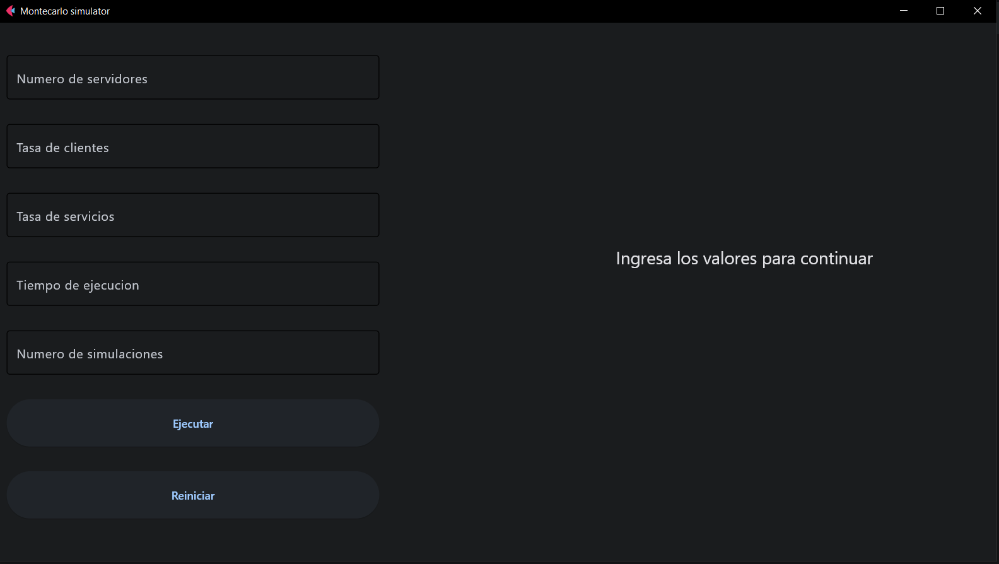

# Simulador de colas

Este proyecto implementa un simulador de sistema de colas con múltiples servidores utilizando Python, Flet y Numpy. El simulador permite configurar el número de servidores, la tasa de llegada de clientes, la tasa de servicio, el tiempo total que se ejecutara la simulacion y el numero de simulaciones que se desean realizar proporcionando factores afectan el tiempo promedio en el sistema y la utilización de los servidores.

# Uso

## Variables de entrada
 - Numero de servidores
 - Tasa de llegada de clientes
 - Tasa de servicios
 - Tiempo de ejecucion de la simulacion
 - Numero de ejecuciones de la simulacion

 # Como puedo usar este proyecto

 ## Ejecuta los siguientes pasos en orden

- git clone <url_del_repositorio>
- cd <nombre_del_directorio_del_proyecto>
- pip install -r requirements.txt
- python main.py

# Herramientas utilizadas

# flet
# numpy

